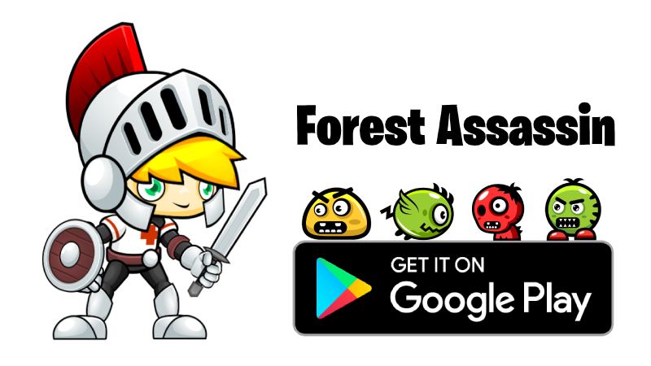

# Forest Assassin Game
Forest Assassin is a 2D adventure platformer game with easy controls and fun gameplay, which helps every one to get started, this is a classic platformer game with wonderfully designed characters and world. To complete the game collect all the coins and the trophy try to collect all 100 gold coins to become the highest scorer in this adventurers platformer game, on your way you will face many obstacles and enemies and use your sword to fight with the enemy.

# Technical Overview
Forest Assassin game is developed through Unity3d game engine and currently, this game is available for both Android & Web platform.

### Android 

On the smartphone user will get the feelings of a classic platformer game. So please download the game and share your experience.

<p>
 <a href="https://play.google.com/store/apps/details?id=com.forestassassin"></a>
</p>

### Web 
This game is compatible with all major desktop browsers Chrome, Firefox, Microsoft Edge, Opera, and Safari which supports WebGL 1.0. 
<p>
 
</p>

### To play the game visit the below link
[https://games.hackbotone.com/forest-assassin](https://games.hackbotone.com/forest-assassin)

### Unity project installation
``````````````````````````
git clone https://github.com/anshumanpattnaik/unity-2d-forest-assassin-game.git
Open /unity-project folder in Unity editor
``````````````````````````

### To play the game in local server
``````````````````````````
git clone https://github.com/anshumanpattnaik/unity-2d-forest-assassin-game.git
cd web-build 
npm install
npm start
``````````````````````````
Open [http://localhost:8000](http://localhost:8000) to view it in the browser.

### Blog & Youtube explanation
[https://hackbotone.com/blog/forest-assassin-2d-platformer-game](https://hackbotone.com/blog/forest-assassin-2d-platformer-game)

[https://www.youtube.com/watch?v=Cm78Do9VO8s&t=579s](https://www.youtube.com/watch?v=Cm78Do9VO8s&t=579s)

### Game & Website, Developed by
[Anshuman Pattnaik](https://www.linkedin.com/in/anshuman123/)

### License
This project is licensed under the [MIT License](LICENSE)
